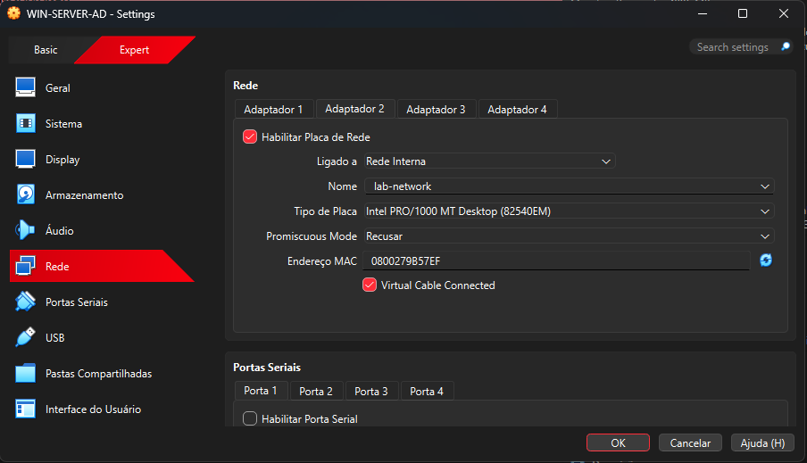
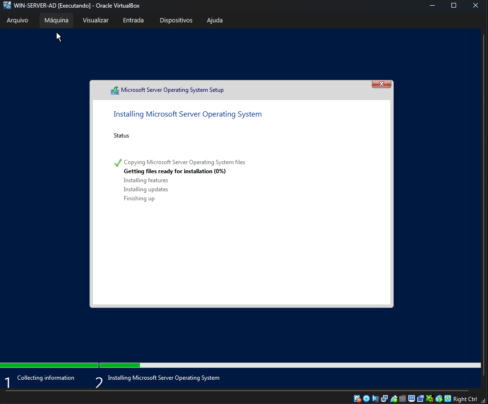
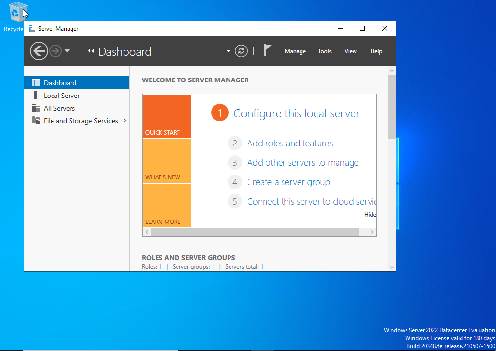
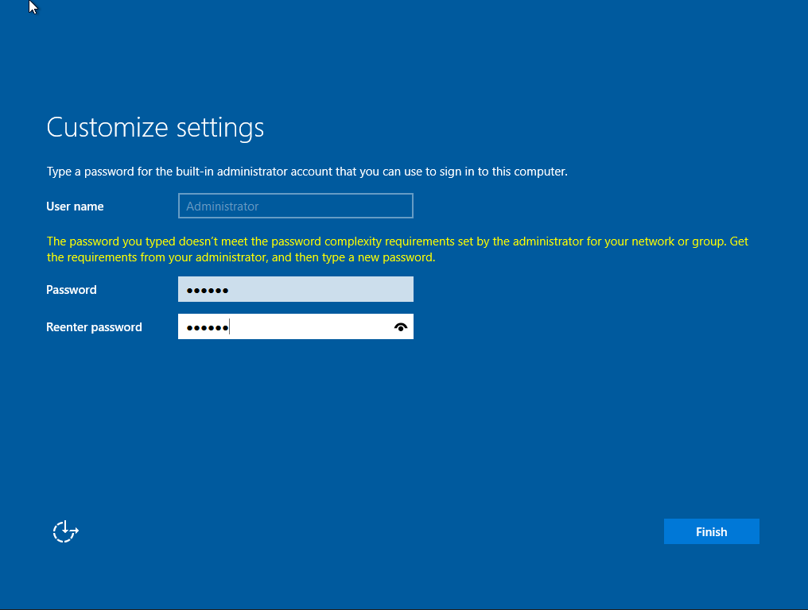
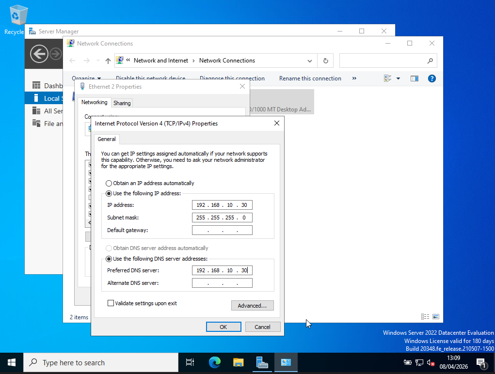
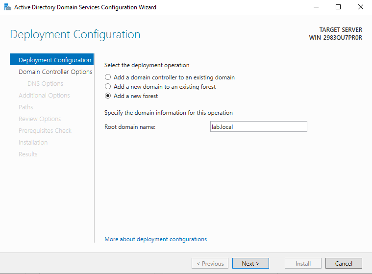
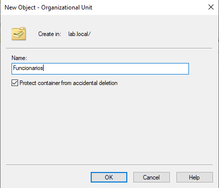
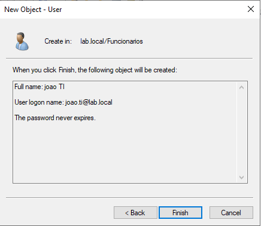
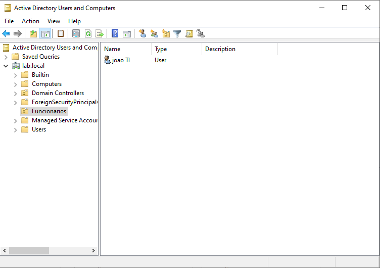

 Lab de Active Directory (AD)

Projeto prático de implementação de Active Directory (AD DS) em ambiente virtualizado, simulando um domínio corporativo para gerenciamento centralizado de usuários e recursos.

---

 Objetivo

- Simular um ambiente empresarial para praticar:

- Administração de domínio

- Gerenciamento de usuários

- Organização por departamentos

- Controle de acesso centralizado

---

 Evidências do Projeto 

 - Ambiente do Servidor

 - Criação da máquina virtual
 

Instalação do Windows Server

Área de trabalho do servidor

 Configuração do Servidor

- Definição de senha do administrador

Configuração de IP fixo

 Active Directory

- Instalação do Active Directory

Criação do domínio

 Estrutura Organizacional

- Criação de departamentos

 Usuários

- Criação de usuário

- Usuário criado com sucesso

---

 Conhecimentos Aplicados

- Active Directory (AD DS)

- Domínio Windows Server

- Organização de usuários (OU)

- Administração de ambiente corporativo

- Gerenciamento centralizado

----

 Resultado

Foi possível implementar um ambiente de domínio funcional com Active Directory, simulando um cenário real de infraestrutura corporativa com gerenciamento de usuários e estrutura organizacional.
